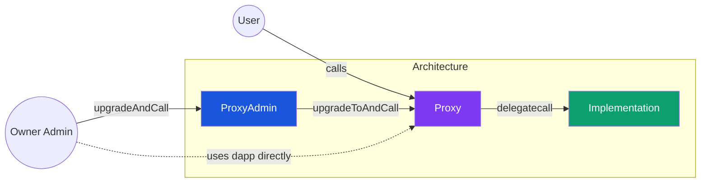
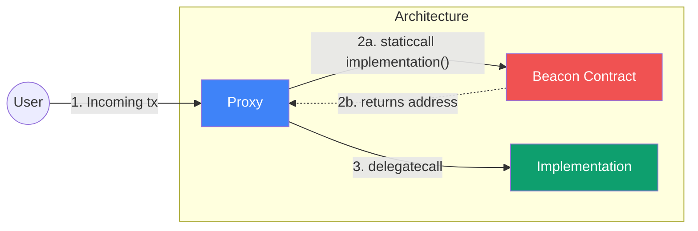

# Delegatecalls and Proxies

## 1. Understanding ABI Encoding for Function Calls

**ABI (Application Binary Interface) encoding** is the strict, low-level data format used to interact with the EVM. 

Whenever an EOA (a normal user wallet) makes a function call to a smart contract, or whenever a smart contract makes an external call to *another* smart contract, the function name and its arguments must be translated into raw hexadecimal byte arrays. This translation process is ABI encoding.

At the hardware level, the EVM has no concept of "functions," "strings," or "arrays"—it only understands raw bytes. ABI encoding is the universal standard that dictates exactly how complex data structures and function signatures are packed into a raw byte payload so the EVM can parse and execute them.

### Anatomy of an ABI Encoded Call
When a function is called, the resulting ABI-encoded byte array is simply the concatenation of two things:
1. **The Function Selector** (4 bytes)
2. **The Encoded Arguments** (if the function takes any)

In Solidity, you can manually construct these byte payloads to execute low-level calls to other contracts using `abi.encodeWithSignature`:

```solidity
// Calling foo(uint256) and passing 5 as the argument
(bool success, ) = otherContractAddr.call(abi.encodeWithSignature("foo(uint256)", 5));
```

### The Function Selector
The function selector is how the EVM identifies *which* function inside a contract you are trying to execute. It is simply the **first 4 bytes of the Keccak-256 hash of the function signature string**.

You can compute this directly in Solidity:
```solidity
function getSelector() public pure returns (bytes4) {
    // The hash of "transfer(address,uint256)" results in 0xa9059cbb...
    return bytes4(keccak256("transfer(address,uint256)")); 
}
```

#### Signature Corner Cases
When writing a function signature as a string (like `"transfer(address,uint256)"`), there are extremely strict formatting rules you must follow. If you make a mistake, the resulting hash will be completely wrong and the EVM will reject the call:
- **No spaces:** `"foo(uint256)"`, never `"foo(uint256 )"` or `"foo(uint256, address)"`.
- **Use canonical types:** You must use the full type name (e.g., use `uint256`, never `uint`).
- **Structs:** Treated as tuples (e.g., `(uint256,address)`).
- **Addresses & Contracts:** `payable` addresses, interface types, and contract names must all be written simply as `address`.
- **Enums:** Treated as `uint8`.
- **User Defined Types:** Treated as their underlying primitive type.
- **Modifiers:** Location keywords like `memory` and `calldata` are ignored entirely.

#### Note: Function Selector Collisions
Because the function selector is only 4 bytes long (yielding about 4.29 billion possible combinations), mathematical collisions are inevitable. If two entirely different function signatures happen to produce the exact same 4-byte hash:
- **Within a Single Contract:** The Solidity compiler will detect the duplicate hashes and throw a fatal `DeclarationError: Function signature hash collision`. You must rename one of the functions or change its arguments to randomize the hash and resolve the collision.
- **Across Multiple Contracts (Proxies):** The compiler cannot save you if a collision occurs between two separately compiled contracts (like a Proxy and its Logic contract). This leads to the infamous "Function Selector Clash" vulnerability, which must be solved using strict routing architectures (like the Transparent Proxy Pattern).

### Calldata & 32-Byte Padding
When a transaction is sent, the resulting ABI-encoded byte payload is not stored permanently in the contract's storage. Instead, it lives in a special, highly efficient EVM memory space called **`calldata`**. 

Because `calldata` represents the exact input bytes sent by the transaction sender, it is strictly **read-only**—it cannot be modified during execution.

When packing arguments into `calldata`, the EVM universally operates on **32-byte words**. Therefore, every single encoded argument is forced into a 32-byte slot. If an argument (like a `uint8` or an `address`) does not naturally take up 32 bytes, it is automatically padded with zeros to fill the remaining space.

### Fixed vs. Dynamic Types
Understanding exactly how the EVM pads and encodes these 32-byte words requires dividing Solidity's data types into two strict categories: fixed and dynamic.

#### Fixed-Size Types
These types have a known, predictable size at compile time. They are encoded perfectly sequentially in `calldata`.
- `bool`
- `uint<M>` and `int<M>` (e.g., `uint256`, `int8`)
- `bytes<N>` (fixed-size byte arrays like `bytes32` or `bytes4`)
- `address`
- Fixed-size arrays (e.g., `uint256[5]`)
- Tuples and Structs (but *only* if all of their internal elements are also fixed-size)

#### Dynamic Types
These types have a variable length that cannot be predicted at compile time. They require a more complex "head and tail" encoding scheme to be packed into 32-byte slots.
- `bytes` (dynamic byte arrays)
- `string`
- Dynamic arrays (e.g., `uint256[]`)
- Fixed-size arrays that contain dynamic types (e.g., `string[5]`)
- Tuples and Structs that contain *any* dynamic types

### Encoding Dynamic Types (The Offset)
Because dynamic types have a variable length, the EVM cannot simply pack them perfectly sequentially into `calldata`. If it did, it wouldn't know where one argument ends and the next one begins.

To solve this, the EVM uses a "Head and Tail" encoding architecture. 
- In the **Head** (the sequential 32-byte slot where the argument *should* be), the EVM stores an **Offset**. 
- The **Offset** is a 32-byte pointer (an integer) that tells the EVM: *"The actual data for this argument doesn't live here. Jump forward X bytes into the calldata to find where the real data starts."*
- The **Tail** (located at that exact offset pointer) contains the actual dynamic data.

#### Example: ABI Encoding a `string`
Because a `string` is a dynamic data type, it strictly requires this Offset architecture. Encoding a single string argument involves exactly three pieces of data (each taking up 32-byte slots):

1. **The Offset (Head):** Located in the normal sequential argument slot, this pointer tells the EVM exactly where the string data begins (e.g., `0x00...0020`, meaning "jump forward 32 bytes").
2. **The Length (Tail Start):** At the location pointed to by the offset, the very first 32-byte word dictates the exact length of the string in bytes (so the EVM knows exactly how much data to read).
3. **The Content:** Immediately following the Length word is the actual UTF-8 encoded string content. If the string is shorter than 32 bytes, it is padded with zeros to perfectly fill out the slot.

## 2. The EVM Execution Context (Call Frames)
Unlike traditional operating systems (like Linux) that spawn new concurrent "processes" with isolated PIDs and virtual memory, the EVM is a strictly single-threaded, synchronous state machine. 

When a transaction triggers a smart contract, the EVM spins up a temporary, lightweight **Execution Context** (often called a **Call Frame**). 

### The Anatomy of a Call Frame
Each Call Frame is granted its own isolated environment for the duration of the function execution:
1. **`calldata`:** The raw, read-only byte payload sent by the transaction sender. 
2. **`memory`:** A fresh, blank linear byte array acting as temporary RAM. It is fully writable.
3. **`storage`:** Access to the permanent blockchain state (the hard drive).

When you use the `memory` keyword in a Solidity parameter (e.g., `function foo(string memory myString)`), the compiler automatically injects opcodes that literally copy the string data out of the read-only `calldata` and paste it into the writable linear `memory` strip before your function logic even begins.

### The EVM is "Blind" (But the Bytecode "Knows")
The EVM itself does not dynamically "figure out" how to split the arguments in the calldata. It is totally blind.

However, the **compiled bytecode knows exactly how to interpret the arguments**. When your contract compiles, the Solidity compiler maps out exactly what data types the function expects, and hardcodes the exact byte-slicing instructions directly into the bytecode. 

1. The **Function Dispatcher** (a giant `switch` statement of `EQ` and `JUMPI` opcodes at the top of the contract) reads the 4-byte selector and jumps to the correct bytecode block.
2. Inside that block, hardcoded `CALLDATALOAD` opcodes instruct the EVM exactly which byte offsets to read (e.g., *"read 32 bytes starting at byte 4"*). 

The EVM simply and blindly follows these hardcoded instructions to unpack the arguments, trusting that the compiler set up the bytecode correctly! 

### Death of the Context
When the Call Frame hits a `RETURN` or `REVERT` opcode, the entire execution context is instantly destroyed. Both the read-only `calldata` and the linear `memory` array are completely wiped clean. The only data that survives the death of the Call Frame is what was explicitly written to permanent `storage`.

## 3. Where is Bytecode Stored? (The Account Object)
It is a common misconception that a contract's compiled bytecode is stored inside its `storage` alongside its state variables. It is not.

In Ethereum, every single address (both User Wallets and Smart Contracts) is represented by an **Account Object** in the global state database. Every Account Object contains exactly 4 fields:
1. **`nonce`:** The number of transactions sent (or contracts created) by the address.
2. **`balance`:** The amount of raw ETH the address holds.
3. **`storageRoot`:** A pointer to the database tree that holds the contract's writable `storage` variables.
4. **`codeHash`:** A pointer to the **immutable compiled bytecode**.

*(Note: For a normal user wallet (EOA), the `codeHash` is simply the hash of an empty string, which is exactly how the EVM knows it is a wallet and not a contract!)*

When a transaction is sent to a smart contract, the EVM looks up the destination address, sees that it has a valid `codeHash`, fetches the immutable bytecode from the database, and executes it. 

Because the `codeHash` is completely structurally separate from the writable `storageRoot`, **bytecode is 100% immutable**. While you can freely update your `storage` variables all day, you can never change the physical bytecode once it is deployed. This permanent immutability is the exact reason why Proxy architectures (which we will cover next) were invented!

## 4. Storage Slots in Solidity: Storage Allocation and Low-level Assembly Storage Operations

### Smart Contract Storage Architecture
Variables in a smart contract store their value in two primary locations: **storage** and **bytecode**.

#### Bytecode (Immutable)
The bytecode stores immutable information. This includes the values of `immutable` and `constant` variable types. Because they are baked directly into the physical bytecode at compile time, they do not take up any storage slots, and reading them is significantly cheaper than reading from state.

#### Storage (Mutable)
The storage holds mutable information. Variables that store their value in the storage are called **state variables** or **storage variables**.
When we interact with a storage variable in Solidity, under the hood, we are actually reading and writing from the global Ethereum database, specifically at the exact **storage slot** where the variable keeps its value.

### Anatomy of a Storage Slot
A smart contract’s storage is organized into an astronomically large dictionary of storage slots. Each individual slot has a fixed storage capacity of exactly **256 bits (32 bytes)**. A contract has access to $2^{256}$ of these slots.

#### Inside Storage Slots: 256-bit Data
Variables are assigned to these slots based on their data type:
- **Primitive Datatypes:** Basic types like `uint256`, `address`, and `bool` are stored sequentially starting from Slot 0. If multiple primitive variables are small enough (e.g., two `uint128`s), the compiler will tightly pack them into a single 256-bit slot to save gas.
- **Complex Datatypes:** Types such as structs (`struct{}`), dynamic arrays (`array[]`), mappings (`mapping(address => uint256)`), strings (`string`), and dynamic bytes (`bytes`) have a much more complicated storage slot allocation relying heavily on Keccak-256 hashing. *(Note: The exact allocation rules for complex datatypes require a dedicated deep dive).*

### Storage Packing
When you declare primitive state variables in Solidity, the compiler assigns them sequentially to storage slots, starting at **Slot 0**, then **Slot 1**, and so forth.

Because interacting with storage (`SSTORE` and `SLOAD`) is highly expensive, the Solidity compiler attempts to optimize this by **packing** multiple small variables into a single 32-byte (256-bit) slot.

#### How Packing Works
If a variable takes up less than 32 bytes (for example, a `uint128` is only 16 bytes, and an `address` is 20 bytes), the compiler will check if the *next* variable declared in the code can also fit into the remaining space in the current slot. If it can, they are packed together. If it cannot, the compiler skips the remaining space and starts a fresh slot.

**Example of Good Packing (2 Slots):**
```solidity
uint128 a; // 16 bytes -> Fits in Slot 0
uint128 b; // 16 bytes -> Fits perfectly in Slot 0!
uint256 c; // 32 bytes -> Too big. Starts Slot 1
```
In this scenario, `a` and `b` share Slot 0. Reading both variables together is cheaper because it only requires one `SLOAD`.

#### Order Matters
The Solidity compiler reads your variables strictly top-to-bottom. It will **not** magically reorder your variables to optimize packing for you. 

**Example of Bad Packing (3 Slots):**
```solidity
uint128 a; // 16 bytes -> Starts Slot 0
uint256 b; // 32 bytes -> Doesn't fit in Slot 0! Starts Slot 1.
uint128 c; // 16 bytes -> Starts Slot 2.
```
Even though `a` and `c` could perfectly fit into a single slot together, the massive `uint256` in the middle breaks the sequence. This contract takes up 3 storage slots instead of 2, significantly increasing deployment and operational gas costs!

### Low-level Assembly Storage Operations (Yul)
Low-level assembly (Yul) gives developers a much higher degree of freedom in performing storage-related operations. It allows us to bypass Solidity's strict typing and directly read or write to individual raw storage slots.

**Important Note on Yul Types:** In assembly, Solidity's rich type system (`uint8`, `address`, `bool`) does not exist. Every single variable in Yul is essentially treated as a raw `bytes32` (a 256-bit word). If you are reading a slot that contains multiple packed variables, Yul will just hand you the entire 32-byte block, and it is up to you to manually bit-shift and mask the data to extract the specific variable you want!

When using Yul blocks (`assembly { ... }`), we can access two hidden properties of any state variable:
1. `variable.slot`: Returns the exact numeric storage slot (e.g., `0`, `1`) where the variable is stored.
2. `variable.offset`: If the variable is tightly packed into a slot with other variables, this returns the byte offset (from right-to-left) where this specific variable starts inside the 32-byte slot.

Using these properties, you can use the raw EVM opcodes to manipulate the database:
- **`sload(slot)`**: Reads the entire 32-byte chunk of data from the given slot.
- **`sstore(slot, value)`**: Writes an entire 32-byte chunk of data into the given slot.

**Example: Reading and Writing with Yul**
```solidity
uint256 public myNumber = 42;

// Reading from Storage
function readStorageDirectly() public view returns (uint256 data) {
    assembly {
        // Find the slot number for myNumber (which is Slot 0)
        let slotNum := myNumber.slot
        // Read the raw 32 bytes from Slot 0
        data := sload(slotNum) 
    }
}

// Writing to Storage
function writeStorageDirectly(uint256 newValue) public {
    assembly {
        // Find the slot number for myNumber
        let slotNum := myNumber.slot
        // Overwrite the entire 32-byte chunk at Slot 0 with the newValue
        sstore(slotNum, newValue)
    }
}
```
*(Warning: If `myNumber` was packed with other variables in Slot 0, using a raw `sstore` like this would blindly overwrite and destroy the other variables sharing the slot! You would need to use bitwise operations to safely update only a portion of the slot. Furthermore, **`sstore()` does not type check.** Because Yul ignores Solidity's type system, it will happily let you write random bytes into a slot that Solidity expects to be a boolean, permanently breaking your contract logic if you aren't careful!)*

## 5. Low Level Call vs High Level Call in Solidity

A contract in Solidity can interact with and execute functions on other contracts via two distinct methods: 
1. **High-Level Call:** Calling through a defined contract interface (e.g., `IERC20(token).transfer()`).
2. **Low-Level Call:** Using the raw `.call()` method directly on an address (e.g., `address.call(...)`).

Despite both methods ultimately compiling down to the exact same `CALL` opcode at the EVM level, the Solidity compiler treats them drastically differently in terms of syntax, type safety, and error handling.

### Error Handling (The Revert Illusion)
One of the most critical differences is how failures are handled. 

At the raw EVM level, the `CALL` opcode **does not revert the transaction if it fails**. If a contract calls another contract and the destination contract crashes, the `CALL` opcode simply catches the crash, stops it from bubbling up, and pushes a `false` (0) boolean onto the execution stack. It is entirely up to the caller to check that boolean and decide what to do next.

- **High-Level Calls (Automatic Revert):** When you use a high-level interface, the Solidity compiler automatically injects extra bytecode immediately after the `CALL` opcode to check that boolean. If the boolean is `false`, the injected bytecode forces your contract to `REVERT`. This makes high-level calls inherently safe.
- **Low-Level Calls (Manual Check Required):** When you use a low-level `.call()`, the compiler does *not* inject the safety check. It just hands you the boolean and the return data. If the call fails and you forget to manually `require(success)`, your contract will silently continue executing as if everything succeeded, which is a massive and common security vulnerability!

#### The Tuple Return
When executing a low-level call (whether it is `call`, `delegatecall`, or `staticcall`), Solidity always returns a tuple containing two variables:
```solidity
(bool success, bytes memory data) = targetAddress.call(abi.encodeWithSignature("myFunction()"));
```
- `success`: The boolean indicating if the call succeeded (`true`) or reverted (`false`).
- `data`: The raw ABI-encoded bytes returned by the target function. You must manually decode this using `abi.decode()` if you want to read the return values.

**When does `success` equal `false`?**
The `success` boolean will only return `false` if the target execution explicitly or implicitly reverts. There are three primary ways an execution will trigger a revert and return a `false` boolean back to the caller:
1. **Explicit Reverts:** The target contract explicitly encounters a `REVERT` opcode (e.g., failing a `require()` statement, a `revert()` string, or hitting a custom error).
2. **Out of Gas:** The target contract exhausts the gas limit provided to the sub-call.
3. **Prohibited Operations (Panics):** The target contract attempts an illegal EVM operation, such as dividing by zero, accessing an out-of-bounds array index, or causing an arithmetic underflow/overflow.

### The "Empty Address" Trap
A bizarre quirk of the EVM is how it handles calling an address that has absolutely no bytecode (such as an empty address, an EOA wallet, or the zero address). At the raw EVM level, **a `CALL` to an empty address always returns `true` for success!** 

- **High-Level Calls (Existence Check):** To protect you from this EVM quirk, high-level interface calls automatically inject an `extcodesize` check *before* making the call. If the target address has a code size of 0, the injected bytecode forces the transaction to revert immediately, refusing to make the call.
- **Low-Level Calls (No Existence Check):** A low-level `.call()` does *not* perform a prior check to verify whether the called address corresponds to a contract. If you accidentally pass an empty address, the low-level call will silently execute, do absolutely nothing, and return `success = true`. If you rely on that boolean without manually verifying the contract's existence first, your app will falsely assume it successfully executed a function that didn't even exist!

## 6. Delegatecall

To fully understand `DELEGATECALL`, we must first understand the landscape of contract-to-contract communication. The Ethereum Virtual Machine (EVM) offers four distinct opcodes for making calls between contracts:

1. **`CALL` (F1):** The standard method. Executes the target contract's code in the target contract's storage context.
2. **`CALLCODE` (F2):** *(Deprecated)* The predecessor to Delegatecall. It executed the target's code in the caller's storage context, but failed to preserve `msg.sender` and `msg.value`.
3. **`STATICCALL` (FA):** A read-only call. It executes the target's code but strictly enforces that no state modifications (`SSTORE`) can occur during the execution. 
4. **`DELEGATECALL` (F4):** The modern proxy standard. It borrows the target contract's bytecode and executes it entirely within the **caller's storage context**, while perfectly preserving the original `msg.sender` and `msg.value`.

### Executing Logic in the Caller's Environment
When a contract makes a `delegatecall` to a target smart contract, it is essentially telling the EVM: *"Borrow the logic (bytecode) of the target contract, but execute it entirely inside my own environment."*

To understand what "environment" means, look at how the global context variables behave when a **User** calls **Contract A**, and **Contract A** forwards the call to **Contract B**:

| Global Variable | During a normal `.call()` to B | During a `.delegatecall()` to B |
| :--- | :--- | :--- |
| **`msg.sender`** | Contract A | The original User |
| **`msg.value`** | The ETH Contract A explicitly sent | The ETH the User originally sent to A |
| **`address(this)`**| Contract B | Contract A |
| **`Storage`** | Contract B's Database | Contract A's Database |

Because `address(this)` and the storage database remain entirely locked to Contract A, if the borrowed logic updates a balance or changes a variable, the target contract's state remains entirely untouched. Only the calling contract's state is modified!

#### The `CODESIZE` Counterexample
While almost all context variables point to the Proxy (Contract A), there is one notable exception: the `CODESIZE` opcode. 

If the borrowed logic uses assembly to check the size of the currently executing code (`codesize()`), it will return the bytecode size of the **Target Contract (Contract B)**, not the Proxy. This makes perfect logical sense: the EVM kept the Proxy's state, but it *did* explicitly swap out the code. Therefore, the code currently being evaluated by the EVM belongs to the Target!

### Storage Slot Collision
Because the borrowed bytecode blindly executes its instructions against the Caller's storage database, extreme caution must be exercised when using `delegatecall`. If the storage layouts of the two contracts do not match perfectly, a **Storage Collision** will occur, inadvertently destroying the Caller's contract data.

Remember from Chapter 4 that the EVM is "blind." It doesn't know variable names; it only knows exact Slot numbers.

**Example of a Collision:**
- **Proxy Contract (Caller):** Declares `address owner;` at Slot 0.
- **Logic Contract (Target):** Declares `uint256 balance;` at Slot 0.

If the Proxy uses `delegatecall` to execute a function in the Logic contract that says `balance = 500;`, the EVM will blindly write the number `500` into the Proxy's **Slot 0**. 

Because the Proxy thinks Slot 0 holds the `owner` address, the Proxy's owner has just been accidentally overwritten and corrupted! To prevent this, the Proxy and the Logic contract must always have exactly matching variable declarations in the exact same order.

### Decoupling Implementation from Data (Upgradable Contracts)
The entire reason we endure the risks of `delegatecall` and storage collisions is to achieve the Holy Grail of Ethereum development: **Upgradable Smart Contracts**. 

By design, smart contract bytecode is immutable once deployed. If there is a bug, it cannot be fixed. However, by using `delegatecall`, we can successfully **decouple the data from the execution logic**:
- **The Proxy Contract (Data):** Holds all the actual storage, user balances, and state. Its address never changes.
- **The Logic Contract (Implementation):** Holds the executable bytecode. It holds no state of its own.

If a bug is discovered in the Logic contract, we simply deploy a brand new Logic contract with the fixed bytecode. We then update a single storage variable in the Proxy to point to the new address. Because the Proxy holds all the data, no user balances are lost, and the contract is instantly "upgraded" to use the new logic!

### The Low-Level `delegatecall` Opcode (Yul)
Under the hood, when you write `target.delegatecall(data)` in high-level Solidity, the compiler translates it into the raw `delegatecall` Yul opcode. 

Unlike a standard `call`, **sending ETH (`value`) to a contract using `delegatecall` is strictly not allowed at the opcode level.** (Because the context is shared, the `msg.value` is already implicitly inherited from the parent transaction).

The raw assembly opcode takes 6 parameters:
```solidity
success := delegatecall(gas, address, argsOffset, argsSize, retOffset, retSize)
```
- **`gas`**: The amount of gas to forward to the sub-context to execute the bytecode. Any gas not used by the sub-context is seamlessly returned back to the caller. 
  - **EIP-150 (The 63/64 Rule):** Since the Tangerine Whistle fork, the EVM strictly caps the amount of gas you can forward to a sub-context. You can only forward a maximum of **63/64** of the currently available gas. The remaining 1/64th is forcibly reserved for the parent contract. This ensures the parent always has enough gas left over to cleanly finish its own execution (or process a failure) without running out of gas itself.
- **`address`**: The account containing the target bytecode you want to borrow and execute.
- **`argsOffset`**: The byte offset in memory where the input `calldata` payload begins.
- **`argsSize`**: The byte size of the `calldata` payload to copy over.
- **`retOffset`**: The byte offset in memory where the EVM should store the returned data from the sub-context.
- **`retSize`**: The expected byte size of the returned data.

## 7. EIP-1967 Storage Slots for Proxies

> **Core Concept:** EIP-1967 is an Ethereum standard dictating exactly *where* to place the storage variables for the Implementation contract, the Admin, and the Beacon.

EIP-1967 defines the specific storage slots for the administrative information that Proxy contracts need to successfully route calls. Today, it is the foundational storage layout used by almost all modern proxy architectures. For example:
- **OpenZeppelin's** industry-standard Transparent Upgradeable Proxy (TUP) and UUPS contracts both rely entirely on EIP-1967 to define their storage logic.
- **Solady**, the hyper-gas-efficient smart contract library, also provides a UUPS proxy implementation built directly on top of EIP-1967.

> [!IMPORTANT]
> **EIP-1967 is strictly a Storage Standard.** It only dictates *where* certain variables must be stored and *what logs* must be emitted when they change. It does **not** state how those variables are updated, nor does it enforce access controls on who is allowed to manage them.

### The Two Critical Proxy Variables
There are two critical variables a proxy needs to successfully operate:
1. **The Implementation Address:** The address of the Logic contract containing the bytecode to borrow.
2. **The Admin Address:** The address of the user or multisig allowed to upgrade the proxy to a new implementation.

If we declared these as standard state variables (e.g., `address implementation;`), they would be assigned to `Slot 0` and `Slot 1`. As we learned in Chapter 6, this would immediately cause a devastating Storage Collision with the Logic contract's variables.

### Unstructured Storage (The Keccak-256 Solution)
To avoid collisions entirely, EIP-1967 uses a pattern called **Unstructured Storage**. Instead of relying on Solidity's sequential slot assignment (0, 1, 2...), the standard dictates that these proxy variables must be stored at very specific, massively randomized slots generated via Keccak-256 hashing.

Because the EVM storage grid has $2^{256}$ slots, the mathematical probability of a Logic contract accidentally generating the exact same hash and colliding with these slots is essentially zero.

**1. The Implementation Slot**
```solidity
// Hash of the string "eip1967.proxy.implementation" minus 1
bytes32 internal constant IMPLEMENTATION_SLOT = 0x360894a13ba1a3210667c828492db98dca3e2076cc3735a920a3ca505d382bbc;
```

**2. The Admin Slot**
```solidity
// Hash of the string "eip1967.proxy.admin" minus 1
bytes32 internal constant ADMIN_SLOT = 0xb53127684a568b3173ae13b9f8a6016e243e63b6e8ee1178d6a717850b5d6103;
```
*(Note: EIP-1967 explicitly subtracts `1` from the hash to mathematically guarantee that the resulting slot has no known preimage, further increasing security).*

**3. The Beacon Slot (Mass Upgrades)**
EIP-1967 also defines a third slot designed specifically for massive protocol scalability: the **Beacon Slot**.
```solidity
// Hash of the string "eip1967.proxy.beacon" minus 1
bytes32 internal constant BEACON_SLOT = 0xa3f0ad74e5423aebfd80d3ef4346578335a9a72aeaee59ff6cb3582b35133d50;
```
If a protocol deploys 10,000 identical proxy contracts (such as user-specific smart wallets), upgrading them individually would cost an astronomical amount of gas. Instead, all 10,000 proxies use the **Beacon Pattern**. 

Instead of storing the Implementation Address directly, they store the address of a central "Beacon Contract" in their `BEACON_SLOT`. When a Proxy is called, it queries the Beacon to ask: *"What is the current implementation address?"* and then executes the `delegatecall`. 

This allows an admin to upgrade all 10,000 proxies simultaneously by sending **a single transaction** to update the central Beacon Contract!

### Etherscan Integration
A massive secondary benefit of the EIP-1967 standard is that it makes it incredibly easy for block explorers like **Etherscan** to automatically detect if they are looking at a Proxy contract. 

Because the `IMPLEMENTATION_SLOT` coordinate is universally standardized, Etherscan can simply query that exact storage slot on any contract. If a valid address is found there, Etherscan instantly knows it is a Proxy. This is what allows Etherscan to offer the popular **"Read as Proxy"** and **"Write as Proxy"** buttons in their UI, seamlessly fetching the ABI from the Logic contract and presenting it to the user as if they were interacting with a single contract.

## 8. ERC-7201 Storage Namespaces Explained

> **Core Concept:** Instead of letting Solidity automatically assign variables to sequential slots (Slot 0, 1, 2) which easily collide during contract upgrades, ERC-7201 dictates that developers bundle their variables into a `struct` and store that struct at a massively randomized Keccak-256 coordinate (a Namespace).

ERC-7201 is an Ethereum standard for grouping state variables together by a common identifier called a **Namespace**. It also defines exactly how to document this group of variables using standard `NatSpec` annotations.

The primary purpose of ERC-7201 is to radically simplify the management of storage variables during contract upgrades, ensuring that adding new variables to a base contract never accidentally causes a storage collision with variables in an inheriting contract.

### The Problem With Inheritance
To understand why ERC-7201 is necessary, we must look at how Solidity handles storage slots when contracts inherit from one another. Solidity always assigns storage slots sequentially, placing the Parent contract's variables *first*, followed by the Child contract's variables.

**Initial Deployment:**
```solidity
contract Parent {
    uint256 a; // Assigned to Slot 0
}
contract Child is Parent {
    uint256 b; // Assigned to Slot 1
}
```

**The Upgrade Collision:**
If we discover a bug and need to upgrade the `Parent` contract to add a new state variable, we would deploy a new Logic contract that looks like this:
```solidity
contract Parent {
    uint256 a; // Slot 0
    uint256 c; // Slot 1 (NEW VARIABLE)
}
contract Child is Parent {
    uint256 b; // Pushed to Slot 2! (COLLISION)
}
```
Because the EVM blindly reads from slots, when the newly upgraded Logic contract tries to read variable `c` from Slot 1, it will accidentally read the legacy data that actually belongs to `b`! By adding a single variable to the parent, **we inadvertently shifted the entire storage layout of the child, corrupting the contract data.**

### The Historical Solution: The `__gap` Approach
Before ERC-7201 was standardized, protocols (most notably OpenZeppelin) solved this shifting problem using "Storage Gaps". 

They would artificially pad the end of every inheritable base contract with a massive, empty fixed-size array to reserve slots for future upgrades.
```solidity
contract Parent {
    uint256 a; 
    uint256[50] private __gap; // Reserve 50 empty slots!
}
```
If the developers ever needed to add a new variable during an upgrade, they would add the new variable but mathematically shrink the gap by one:
```solidity
contract Parent {
    uint256 a;
    uint256 c; // New variable added
    uint256[49] private __gap; // Gap shrunk from 50 to 49
}
```
Because `1 + 49` equals `50`, the total size of the `Parent` contract remains identical. The Child contract's variables are not pushed down, and the storage collision is entirely avoided!

While brilliant, manually managing, tracking, and recalculating the exact sizes of `__gap` arrays across massive webs of inheritance was notoriously frustrating and error-prone. This pain point directly led to the creation of the mathematical ERC-7201 Namespace standard.

### The ERC-7201 Solution (Dedicated Locations)
The optimal solution to this problem is to abandon Solidity's sequential storage entirely. Instead of forcing all inherited variables to stack on top of each other in a single column (Slots 0, 1, 2, 3...), we should assign **each individual contract in the inheritance chain its own completely isolated, dedicated storage location on the grid.**

This is exactly what ERC-7201 does. 

By defining a unique "Namespace" (a massively randomized Keccak-256 hash) for each contract, we can isolate that contract's variables far away from any other contract's variables. 

If we upgrade a parent contract and add a new variable to its Namespace, it simply expands into its own isolated section of the grid. It never shifts or interferes with the child contract's variables because the child contract lives in a completely different, isolated Namespace on the opposite side of the $2^{256}$ storage grid!

### A Namespace-Based Root Layout (Implementation)
To safely implement ERC-7201, developers bundle all their state variables into a `struct` and then mathematically define a unique storage slot for that struct using the standard's formula.

**The Mathematics of the Root Layout**
Solidity computes the storage locations of all variables, arrays, and mappings based on a formal mathematical grammar:
$$L_{root} := root \ | \ L_{root} + n \ | \text{keccak256}(L_{root}) \ | \text{keccak256}(H(k) \oplus L_{root})$$

- $root$: Slot `0` by default.
- $L_{root} + n$: Sequential variables (e.g., struct properties).
- $\text{keccak256}(L_{root})$: Dynamic arrays.
- $\text{keccak256}(H(k) \oplus L_{root})$: Mappings.

Normally, Solidity hardcodes the $root$ to be Slot `0`. ERC-7201 is incredibly elegant because it doesn't change Solidity's underlying math; it simply **redefines the $root$**. 

> [!IMPORTANT]
> **As defined by the standard:** *The concept of namespaces in smart contracts aims to ensure that the root of the storage layout of a contract using a namespace is no longer located in slot zero, but in a specific slot determined by the chosen namespace.*

All sequential struct variables, dynamic arrays, and mappings still calculate perfectly—they just mathematically branch off the new isolated root coordinate instead of `0`!

**The ERC-7201 Formula:**
```solidity
// keccak256(abi.encode(uint256(keccak256("namespace_id")) - 1)) & ~bytes32(uint256(0xff))
```

> **Why is this formula so complex?**
> The formula proposed above is used to mathematically guarantee a crucial property of the new root: **that it does not collide with an original grammar element.** By double-hashing and subtracting `1`, it ensures the generated Namespace is far outside the possible space of storage locations the Solidity compiler could ever naturally assign a variable, array, or mapping to by default. 
> 
> *(Note: The formula also purposefully zeroes out the final byte `~0xff` to prevent unaligned storage reads/writes, ensuring the struct always starts cleanly at a full 32-byte slot boundary).*

**Implementation Example:**
```solidity
contract Parent {
    // 1. Define the unique namespace string (usually the contract name)
    bytes32 private constant PARENT_STORAGE_LOCATION = 
        0xabc123...; // (The pre-calculated ERC-7201 hash for "my.app.Parent")

    // 2. Bundle all state variables into a Struct
    struct ParentStorage {
        uint256 a;
        uint256 c;
    }

    // 3. Create a helper function to retrieve the struct from the randomized slot
    function _getParentStorage() private pure returns (ParentStorage storage $) {
        assembly {
            // Point the struct '$' to the randomized Keccak coordinate
            $.slot := PARENT_STORAGE_LOCATION
        }
    }

    // 4. Use the variables safely!
    function setA(uint256 _a) external {
        ParentStorage storage $ = _getParentStorage();
        $.a = _a; 
    }
}
```

### NatSpec for Custom Storage Locations
The final requirement of the ERC-7201 standard is documentation. To ensure that external tooling (like Foundry, Hardhat, or security scanners like Slither) can automatically detect and verify these custom storage layouts, developers must annotate the struct using a specific NatSpec tag: `@custom:storage-location <FORMULA_ID>:<NAMESPACE_ID>`.

For example, to properly document the struct from our example above:
```solidity
/// @custom:storage-location erc7201:my.app.Parent
struct ParentStorage {
    uint256 a;
    uint256 c;
}
```
This single line of documentation allows compilers and security tools to instantly parse the source code, calculate the Keccak-256 hash, and verify that the struct is indeed mathematically isolated.

By strictly adhering to this Namespace-Based Root Layout and NatSpec documentation, OpenZeppelin and massive Web3 protocols are able to upgrade infinitely complex, multi-inheritance smart contracts without ever fearing a storage collision again.

## 9. The Transparent Upgradeable Proxy Pattern Explained in Detail

The Transparent Upgradeable Proxy (TUP) pattern was created to solve a very specific, catastrophic vulnerability in Proxy architectures: **The Function Selector Clash.**

### The Function Selector Clash
As previously discussed, the core mechanic of a Proxy is that it uses a `fallback()` function to blindly intercept all incoming calls and `delegatecall` them to the Logic contract. 

However, Proxies also need their own internal functions so the admin can manage the contract (e.g., an `updateImplementation(address)` function to change the Logic contract address).

The vulnerability arises when an administrative function inside the Proxy happens to have the exact same 4-byte function selector as a user-facing function inside the Logic contract. Because function selectors are only 4 bytes long, the chances of two entirely different function names hashing to the same 4-byte selector is statistically non-negligible.

If a user attempts to call the Logic contract, but their function selector accidentally matches the Proxy's `updateImplementation()` selector, the EVM will execute the Proxy's function directly and **never trigger the fallback function!** The call is hijacked, the `delegatecall` never happens, and the user's logic is completely ignored.

### The TUP Solution: The Traffic Cop Fallback
To completely eradicate the possibility of a selector clash, the Transparent Upgradeable Proxy Pattern dictates a radical architectural rule: **There should be absolutely no public functions on the Proxy except the `fallback` function.**

If the Proxy has no public functions, a selector clash is mathematically impossible because the EVM is guaranteed to hit the `fallback` function every single time. 

But this raises a critical question: *If there are no public administrative functions, how does the Admin upgrade the proxy?*

The answer is to turn the `fallback` function into a "Traffic Cop" that deeply inspects the `msg.sender`.
```solidity
fallback() external payable {
    if (msg.sender == admin) {
        // 1. If the Admin is calling, DO NOT delegatecall.
        // Instead, intercept the call and handle the upgrade logic locally.
        _handleAdminCommands();
    } else {
        // 2. If a normal user is calling, blindly delegatecall 
        // to the Logic contract as usual.
        _delegateToLogic();
    }
}
```

This architecture ensures a strict, transparent segregation of powers:
1. **Admins** can only interact with the Proxy's internal administrative logic. They can *never* interact with the user-facing Logic contract.
2. **Users** can only interact with the Logic contract. They can *never* interact with the Proxy's administrative logic.

Because the routing is based entirely on `msg.sender` rather than function selectors, the clash vulnerability is completely eliminated.

### The ProxyAdmin Contract
TUP's strict segregation creates two core problems: 
1. **The Admin is banned from using the Dapp:** The fallback intercepts all their calls, blocking access to the Logic contract.
2. **Immutable Admins:** Modern implementations (like OpenZeppelin v5) store the admin as an `immutable` variable to save gas, meaning it can mathematically never be changed.

To solve both problems, TUP deploys a secondary **`ProxyAdmin`** contract and hardcodes it as the Proxy's immutable admin. The human developer is then given ownership of this `ProxyAdmin` contract.



This elegantly bypasses all restrictions:
- **Upgrading:** The developer tells the `ProxyAdmin` to upgrade the proxy. Because `ProxyAdmin` is the caller, `msg.sender == admin` and the upgrade succeeds.
- **Using the Dapp:** The developer calls the Proxy directly from their EOA. Since their EOA is not the `ProxyAdmin`, `msg.sender != admin` and the call correctly routes to the Logic contract.
- **Transferring Admin Rights:** The developer simply transfers ownership of the `ProxyAdmin` contract to someone else, sidestepping the Proxy's immutable variable entirely.

### OpenZeppelin Implementation Details
If you look at the OpenZeppelin codebase, the Transparent Upgradeable Proxy is elegantly constructed using a strict three-tier inheritance chain:

1. **`Proxy.sol`**: The raw base contract. It contains the bare-bones `fallback()` function and the highly optimized Yul assembly block required to perform the `delegatecall` and return the result. *(Note: While this contract contains helper functions like `_delegate()` and `_implementation()`, they are marked `internal`. Internal functions are not part of the public ABI, have no 4-byte selector exposed to the EVM, and therefore cannot mathematically cause a Function Selector Clash).*
2. **`ERC1967Proxy.sol`** *(inherits Proxy)*: This layer introduces the EIP-1967 Unstructured Storage logic, utilizing the exact Keccak-256 coordinates for the `IMPLEMENTATION_SLOT`.
3. **`TransparentUpgradeableProxy.sol`** *(inherits ERC1967Proxy)*: The final layer. It introduces the `admin` variable and overrides the `fallback()` function to inject the "Traffic Cop" routing logic (`if msg.sender == admin`).

### Initialization: Why `upgradeToAndCall()`?
When examining the ProxyAdmin architecture, you might notice that the upgrade function is called `upgradeToAndCall(address newImpl, bytes data)` instead of a simple `upgradeTo(address newImpl)`. 

This is a critical security mechanic designed to prevent **front-running during initialization**.

When you upgrade a proxy to a brand new Logic contract, the new Logic contract often has new state variables that need to be initialized. However, because you are using a proxy architecture, the Logic contract's `constructor()` cannot be used (constructors only run once during deployment and only affect the Logic contract's local storage, not the Proxy's storage). Instead, developers must use a standard `initialize()` function.

If an admin were to upgrade the proxy and initialize it in two separate transactions:
1. `Tx1: upgradeTo(newLogic)`
2. `Tx2: initialize(configVariables)`

A malicious MEV bot could see `Tx1` land on-chain, instantly realize the newly upgraded contract is currently uninitialized, and front-run `Tx2` by calling `initialize(maliciousVariables)` themselves, permanently hijacking the new implementation!

`upgradeToAndCall()` solves this by executing both actions atomically in a single transaction. The Proxy updates its implementation address and immediately triggers a `delegatecall` to the new Logic contract using the provided `data` payload (usually the ABI-encoded `initialize()` function call). 

*(Note: If `data.length == 0`, it gracefully skips the `delegatecall` and acts exactly like a standard `upgradeTo()`)*.

### The Empty Contract Safeguard (`extcodesize`)
There is one final, critical restriction placed on the `ProxyAdmin` when upgrading: **They cannot upgrade the Proxy to an empty address (an EOA or an un-deployed contract).**

If a Proxy were accidentally upgraded to point to an EOA, any subsequent `delegatecall` to that address would silently return `true` (because low-level calls to non-contracts succeed but return empty data). This would effectively brick the entire application, causing all function calls to silently fail without reverting!

To prevent this catastrophic failure, OpenZeppelin's internal `_setImplementation` function uses assembly to explicitly check the `extcodesize` of the new implementation address. If the code length of the target address is `0`, the upgrade immediately reverts.

### Summary of TUP
To summarize the Transparent Upgradeable Proxy architectural pattern:
1. **The Goal:** TUP is designed entirely to prevent Function Selector Clashing between the Proxy's administrative functions and the Implementation's user functions.
2. **The Mechanism:** The `fallback()` function is the only public function on the Proxy. It acts as a traffic cop. If `msg.sender == admin`, the call is routed to internal administrative logic. If `msg.sender != admin`, the call is `delegatecall`ed to the implementation.
3. **The EIP-1967 Compliance:** TUP uses an `immutable` variable to store the admin to save gas. However, to remain strictly compliant with ERC-1967 (and readable by block explorers like Etherscan), it still redundantly writes the admin address to the standardized EIP-1967 admin storage slot during deployment, even though the contract itself never needs to read from that slot.
4. **The ProxyAdmin:** Because the Proxy's admin is an `immutable` variable and mathematically cannot be changed, the admin is set to an intermediate smart contract called `ProxyAdmin`. The owner of the `ProxyAdmin` contract can freely interact with the Dapp as a normal user, and can easily change administrative rights by transferring ownership of the `ProxyAdmin` contract.

## 10. The Beacon Proxy Pattern Explained

> **Core Concept:** A Beacon Proxy is a pattern where multiple proxies share the same implementation contract, allowing an admin to upgrade them all simultaneously in a single transaction.

### How it Works
Instead of storing the Logic address locally, proxies store the address of a central **Beacon Contract**. The Beacon acts as the absolute **source of truth** (hence the name), holding the current implementation address and returning it via a public function.

When a user calls the Proxy:
1. The Proxy `staticcall`s the Beacon to get the current implementation address.
2. The Proxy `delegatecall`s to that returned address.



### Upgrading the Beacon
To perform a network-wide upgrade, the Admin simply calls `upgradeTo(newImplementationAddress)` directly on the **Beacon Contract**. By updating this stored address just once, the Admin instantly reroutes all connected proxies to the new logic simultaneously!

### EIP-1967 Compliance (`BeaconProxy.sol`)
For block explorers like Etherscan to know that they are looking at a Beacon Proxy, the proxy must strictly adhere to the EIP-1967 specification. 

Because it is specifically a Beacon Proxy, it must store the Beacon's address in the standardized EIP-1967 Beacon storage slot:
`0xa3f0ad74e5423aebfd80d3ef4346578335a9a72aeaee59ff6cb3582b35133d50`
*(Computed from `bytes32(uint256(keccak256('eip1967.proxy.beacon')) - 1)`)*

Similar to how the Transparent Upgradeable Proxy treats its admin variable, this EIP-1967 storage slot is **not actually used** by the `BeaconProxy` internal logic. It is simply a redundant signal broadcasted for block explorers. 

The actual Beacon address is stored inside the `BeaconProxy` as an `immutable` variable to save massive amounts of gas, since the Proxy's designated Beacon contract mathematically never changes!

### Gas Optimization: EIP-2930 Access Lists
Because of the architectural design of a Beacon Proxy, **every single transaction** sent to the proxy must first perform an external `staticcall` to the Beacon contract to read the implementation address from its storage.

To optimize gas costs, developers and frontends should always use **EIP-2930 Access List transactions** when interacting with a Beacon Proxy. 

By passing an Access List that pre-declares the address of the Beacon contract and the specific storage slot holding the implementation address, the EVM can "pre-warm" these resources before the transaction even begins executing. This significantly reduces the cold-access gas penalties of the cross-contract call and storage read, making the Beacon Proxy pattern much more economically viable for high-frequency user interactions.

### The BeaconProxyFactory
The primary use case of the Beacon Proxy pattern is to efficiently manage massive numbers of identical proxies (such as assigning a unique smart contract wallet to 10,000 different users).

Because deploying these proxies manually would be a massive hassle, this architecture is almost universally paired with a **Factory Contract**.

The `BeaconProxyFactory` is a smart contract designed simply to "stamp out" new `BeaconProxy` clones on demand. When a new user joins the protocol, the Factory automatically deploys a new `BeaconProxy` and passes the central Beacon's address directly into the new proxy's `constructor()`. This guarantees that every newly deployed proxy is instantly linked to the correct, globally synchronized source of truth.

### Tooling: OpenZeppelin Upgrades Plugin
If you are developing your contracts locally, you do not need to write these complex factory deployment scripts from scratch. OpenZeppelin provides an official **Upgrades Plugin** for both Hardhat and Foundry that handles the Beacon proxy architecture natively.

Deploying and managing a Beacon ecosystem is as simple as calling their built-in functions:
1. **`deployBeacon(LogicContract)`**: Deploys the Logic contract and the central Beacon contract, instantly linking them together.
2. **`deployBeaconProxy(BeaconAddress)`**: Stamps out a new proxy connected to your central Beacon.
3. **`upgradeBeacon(BeaconAddress, NewLogicContract)`**: Automatically deploys the new Logic contract and updates the central Beacon to point to it, instantly upgrading all of your proxies simultaneously!

## 11. EIP-1167: Minimal Proxy Standard with Initialization (Clone pattern)

> **Core Concept:** EIP-1167 (Minimal Proxy) is an extremely gas-optimized proxy architecture. Unlike the regular proxy pattern, several "clones" can be deployed that all point to the exact same shared implementation contract. However, unlike TUP or Beacon proxies, **Clones cannot be upgraded.** Their implementation address is hardcoded directly into their bytecode during deployment.

### The 55-Byte Bytecode
The magic of the Minimal Proxy is that it does not use a massive Solidity contract. Instead, it is deployed using raw, highly-optimized EVM bytecode that totals exactly **55 bytes**.

This incredibly concise 55-byte sequence contains everything a proxy needs to function, cleanly broken down into the following components:
1. **The Init Code:** Used once during deployment to place the runtime bytecode on-chain.
2. **The Runtime Code:** Copies the incoming transaction calldata into memory.
3. **The 20-Byte Address:** The hardcoded address of the shared implementation contract.
4. **The Delegatecall:** Forwards the calldata to the hardcoded address.
5. **The Return/Revert:** Captures the returned data from the `delegatecall` and explicitly returns it to the user (or triggers a `revert` if the internal call failed).

Here is the exact bytecode string defined by EIP-1167. Notice the 20-byte `bebebe...` placeholder sequence in the middle. During deployment, a Factory contract dynamically replaces this placeholder with the actual address of your Logic contract:

```text
3d602d80600a3d3981f3363d3d373d3d3d363d73bebebebebebebebebebebebebebebebebebebebe5af43d82803e903d91602b57fd5bf3
```

### The Factory Deployment Assembly
To deploy this bytecode on-chain, a Factory contract must stitch together the final 55-byte string dynamically in memory. It does this by splitting the bytecode into three chunks (Prefix, Address, Suffix) and utilizing the `mstore` assembly opcode. 

Once the bytecode is pieced together in memory, the factory calls the `create` opcode to deploy the new clone:

```solidity
contract MinimalProxyFactory {
    address[] public proxies;

    function deployClone(address _implementationContract) external returns (address) {
        bytes20 implementationContractInBytes = bytes20(_implementationContract);
        address proxy;

        assembly {
            // Load the free memory pointer
            let clone := mload(0x40)
            
            // 1. Store the first 20 bytes (The Creation Code + Runtime Prefix)
            mstore(
                clone,
                0x3d602d80600a3d3981f3363d3d373d3d3d363d73000000000000000000000000
            )

            // 2. Store the 20-byte Implementation Address at an offset of 0x14 (20 bytes)
            mstore(add(clone, 0x14), implementationContractInBytes)

            // 3. Store the remaining 15-byte Suffix at an offset of 0x28 (40 bytes)
            mstore(
                add(clone, 0x28),
                0x5af43d82803e903d91602b57fd5bf30000000000000000000000000000000000
            )

            // Deploy the 55-byte (0x37) sequence in memory using the CREATE opcode
            proxy := create(0, clone, 0x37)
        }

        // Immediately initialize the new proxy to prevent front-running!
        ImplementationContract(proxy).initializer();
        proxies.push(proxy);
        
        return proxy;
    }
}
```

### OpenZeppelin `Clones.sol` Library
While understanding the raw assembly is essential for mastering the EVM, modern developers rarely write these `mstore` blocks from scratch. 

Instead, **OpenZeppelin provides the official `Clones.sol` library**, which abstracts all of this raw memory manipulation away into simple, safe helper functions. To deploy an EIP-1167 proxy in production, you simply import the library and call its built-in functions:

```solidity
import "@openzeppelin/contracts/proxy/Clones.sol";

contract ModernProxyFactory {
    // Attach the library functions to the address type
    using Clones for address; 

    function deployClone(address logicContract) external returns (address) {
        // Automatically stitches the 55-byte bytecode together and calls CREATE
        address proxy = logicContract.clone();
        
        // Initialize it immediately
        ImplementationContract(proxy).initializer();
        
        return proxy;
    }
    
    function deployDeterministicClone(address logicContract, bytes32 salt) external returns (address) {
        // Same as above, but uses CREATE2 to deploy to a predictable, predetermined address!
        address proxy = logicContract.cloneDeterministic(salt);
        
        ImplementationContract(proxy).initializer();
        
        return proxy;
    }
}
```

## 12. EIP-3448: MetaProxy Standard (Minimal Proxy with Immutable Metadata)

> **Core Concept:** The EIP-3448 MetaProxy standard can be viewed as a direct extension to the EIP-1167 Minimal Proxy Standard. It allows unique, immutable metadata to be attached directly to the end of each clone’s runtime bytecode.

The normal EIP-1167 minimal proxy standard allows us to parameterize the creation of a clone, but this requires executing an extra `initialize()` transaction immediately after deployment to save those parameters into storage. The MetaProxy standard allows users to bypass this step entirely and parameterize the values they care about directly in the clone’s bytecode rather than using storage, which significantly reduces gas costs!

### The MetaProxy Bytecode
Just like the EIP-1167 standard, the MetaProxy is deployed using a raw, highly-optimized EVM hex string. Notice the familiar 20-byte `bebebe...` placeholder sequence where the Factory will insert the shared Implementation contract address.

Here is the exact base bytecode of the MetaProxy (before any metadata is appended):
```text
600b380380600b3d393df3363d3d373d3d3d3d60368038038091363936013d73bebebebebebebebebebebebebebebebebebebebe5af43d3d93803e603457fd5bf3
```

When a Factory deploys a MetaProxy, it simply takes this base string, drops the Implementation address over the placeholder, and then **appends the unique metadata bytes to the very end of the string** before calling `create`.

## 13. noDelegateCall Explained

The `noDelegateCall` modifier is a smart contract security mechanism used to explicitly prevent a contract (or specific functions within it) from being executed via a `delegatecall`. 

In this chapter, we will first explore the technical mechanism of exactly how this restriction is accomplished at the EVM level, and then we will discuss the critical security motivations that make this modifier necessary in modern proxy architectures.

### Motivation: The Uniswap V3 Loophole
To prevent competitors from stealing their code, Uniswap V3 was launched under a strict Business Source License (BSL). However, competitors could have exploited a major technical loophole: **Deploying a minimal proxy pointing directly to the official Uniswap V3 Logic contract.**

This would allow them to run a competing exchange without ever actually copying the proprietary code. 

To permanently block this, Uniswap applied the `noDelegateCall` modifier across their codebase. This explicitly banned unauthorized proxies from "borrowing" their logic.

### The Core Mechanism
Because `noDelegateCall` is a standard modifier, it can be applied granularly to specific state-changing functions, leaving harmless functions accessible.

It relies entirely on checking the `address(this)` execution context:
1. During deployment, the Logic contract saves its own address to an `immutable` variable. 
2. Because `delegatecall` executes in the caller's context, `address(this)` evaluates to the Proxy's address. 
3. If the current `address(this)` does not match the saved deployment address, the transaction instantly reverts.

```solidity
contract NoDelegateCallContract {
    address private immutable ORIGINAL_ADDRESS;

    constructor() {
        ORIGINAL_ADDRESS = address(this); // Save original deployment address
    }

    modifier noDelegateCall() {
        // Reverts if executed inside a Proxy's context via delegatecall
        require(address(this) == ORIGINAL_ADDRESS, "Delegatecall forbidden");
        _;
    }

    function proprietaryLogic() external noDelegateCall {
        // Safe from vampire proxies
    }
}
```
