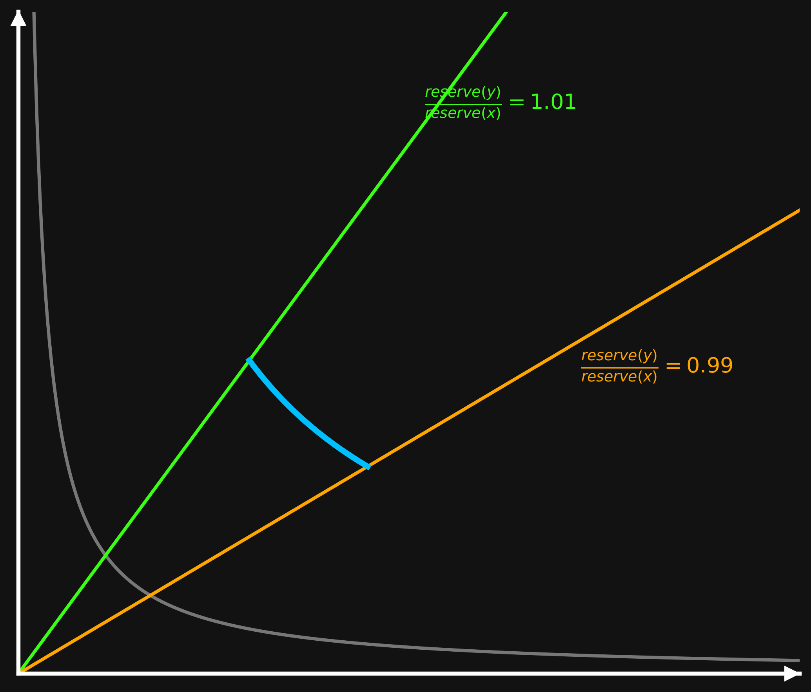
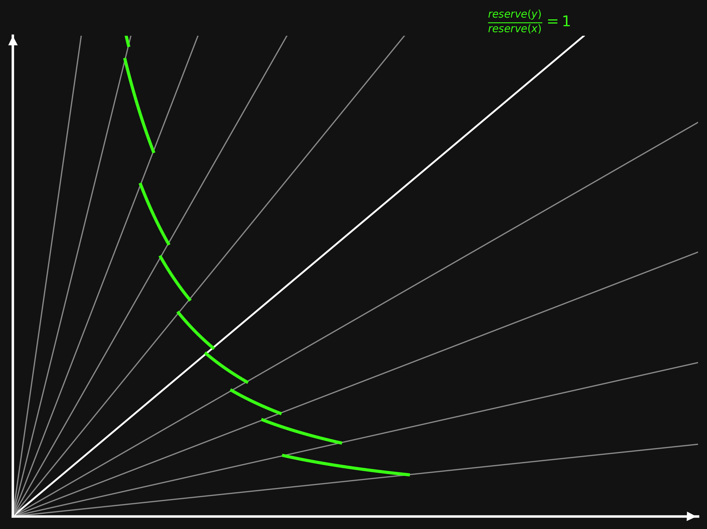
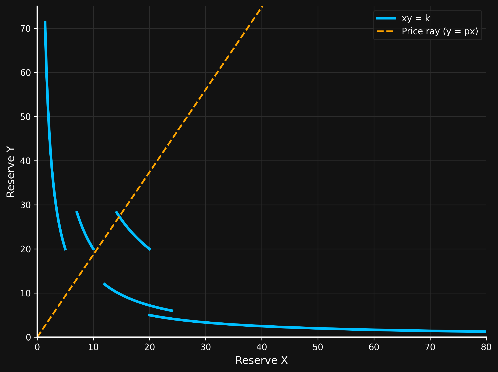
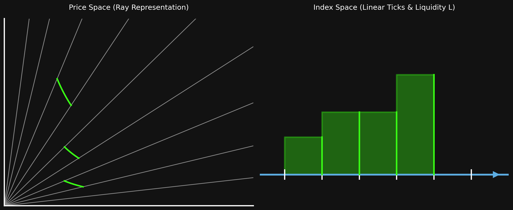
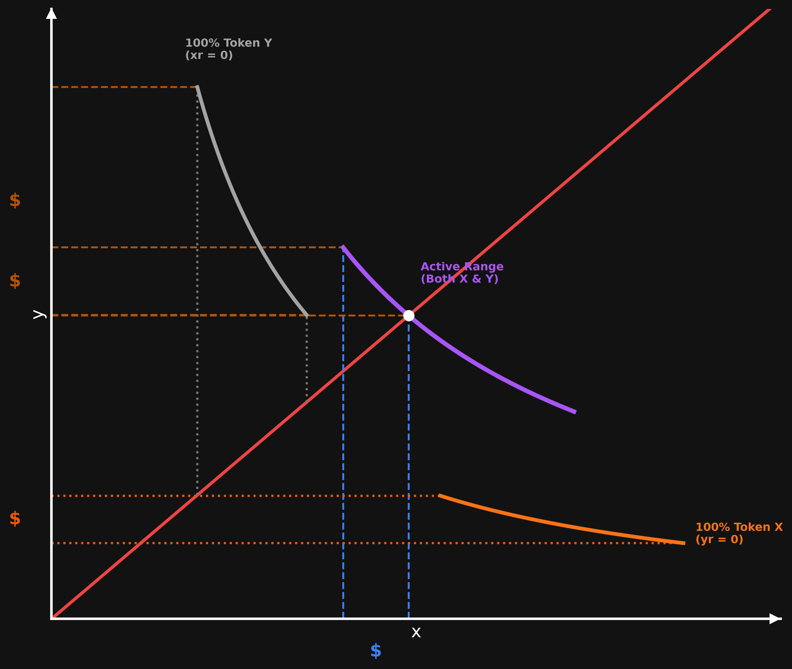

# Uniswap V3

## 1. How Concentrated Liquidity in Uniswap V3 Works

> **Price Impact:** Any trade on an AMM, no matter how small, shifts the pool's asset reserves and changes the marginal price ($\text{price}' > \text{price}$). The difference between the pool's initial price and the execution price resulting from the trade is called **price impact**. A large trade relative to available liquidity causes high price impact.

> **Capital Efficient Liquidity:** In Uniswap V2, liquidity is spread uniformly across the entire price range $(0, \infty)$, meaning most assets sit idle in unused price ranges. Uniswap V3 allows Liquidity Providers (LPs) to allocate capital to specific price intervals $[p_{min}, p_{max}]$. This "concentrated liquidity" dramatically increases capital efficiency, enabling much higher depth and lower price impact for traders using significantly less total capital.

### Concentrating Liquidity (Piecewise AMM Curve)

Conceptually, concentrated liquidity can be thought of as a piecewise function bounded by price rays extending from the origin (e.g., price ratios $p = \frac{\text{reserve}(y)}{\text{reserve}(x)}$).

By applying `if` conditions at price boundaries, the pool adjusts the constant product $k$ depending on whether the price is within the active range:

$$xy = \begin{cases} 0.1k & \text{if } p < 0.99 \text{ or } p > 1.01 \\ 10k & \text{if } 0.99 \le p \le 1.01 \end{cases}$$

- Within the active price range ($[0.99, 1.01]$), the virtual constant product is multiplied (e.g. $10k$), offering much higher liquidity depth and lower slippage.
- Outside this range, liquidity drops off (e.g. $0.1k$), shifting the effective constant product curve.



### How Uniswap V3 Implements Concentrated Liquidity

To make things flexible in letting the LPs decide the ideal boundaries and quantity for where to place liquidity, Uniswap V3 doesn’t use a scaling factor at all. Within certain price boundaries, $k$ will be the liquidity the LPs provide there. That is, liquidity providers can choose from a variety of price regions where they can provide liquidity.

Even though the curves appear to be discontinuous, the price (represented with the orange ray) can transition smoothly between each “mini Uniswap V2 curve.” Each of the “sub curves” are of the form $xy = k$, but $k$ is different for each sub curve.

To keep accounting simple, LPs cannot provide liquidity at arbitrary price boundaries, but at predefined prices called ticks.





### Uniswap V3 Invariant

Uniswap V3 can be conceptualized as using the following invariant:

$$xy = \begin{cases} k_1 & \text{if } \text{tick}_0 \le p < \text{tick}_1 \\ k_2 & \text{if } \text{tick}_1 \le p < \text{tick}_2 \\ k_3 & \text{if } \text{tick}_2 \le p < \text{tick}_3 \\ \vdots & \\ k_n & \text{if } \text{tick}_{n-1} \le p < \text{tick}_n \end{cases}$$

In practice, it is not gas-efficient to check the price against so many potential cases like we do in the formula above. Similarly, keeping track of so many $k$ values is expensive.

## 2. Introducing Ticks in Uniswap V3

In Uniswap V3, prices always refer to the price of token X in terms of token Y. Thus, anytime we write $p$, it refers to the price of token X, given by $p = p_x = \frac{y}{x}$.

### The Tick to Price Formula

We said that ticks are pre-defined prices, but how are these prices defined? They are defined by the following formula:

$$p(i) = 1.0001^i$$

The allowed tick indexes range from $-887,272$ to $887,272$.

### Distinction: Price vs. Ticks
It is important to distinguish between the pool's current active price and the tick prices:
* **Ticks** are specific, discrete price points along the price curve defined by $1.0001^i$. They serve as boundaries where LPs can set their position limits.
* **The current pool price ($p$)** is a continuous value that transitions smoothly between these ticks as swaps occur. The pool's actual trading price can be any arbitrary number (e.g., a price between two ticks), whereas tick prices are restricted to the fixed values calculated by the formula above.

### Why 1.0001?
According to the Uniswap V3 Whitepaper, the base value $1.0001$ was chosen because:
> "This has the desirable property of each tick being a 0.01% (1 basis point) price movement away from each of its neighboring ticks."

### Visualizing Tick Spaces (Ray vs. Linear Representations)
By using tick indexes, Uniswap V3 maps a non-linear price space into a linear integer index space. LPs can place liquidity at discrete tick intervals, creating a stepped distribution of liquidity depth ($L$) across ticks:



### The Current Tick
Uniswap V3 keeps track of the "active tick", "current tick", or sometimes just "tick". The **current tick** is defined as the current price rounded down to the nearest tick.

In code, the protocol stores the current tick (along with `sqrtPriceX96`) in storage slot 0 inside a struct named `Slot0`.

## 3. Q Number Format

Q numbers are a design pattern to hold fractional numbers in Ethereum.

They are more efficient than standard decimal representation since conversion and scaling can be accomplished with bitshifting.

A Q number is represented as **$Qm.n$**, where $m$ is the number of bits for the integer portion and $n$ is the number of bits for the fractional portion. Each bit after the binary point represents fractional values of $\frac{1}{2}, \frac{1}{4}, \frac{1}{8}, \dots$ etc.

* **Conversion:** An integer can be converted into a Q number by doing a left bitshift by $n$ bits (`a << n`). A Q number can be converted back to an integer by truncating the fraction bits via right-shifting by $n$ bits (`q >> n`).
* **Floating Point Equivalence:** If we divide a Q number by $2^n$ in a language that supports floating points, we get its true decimal value.
* **Ratios:** Given two integers $a$ and $b$ (ensuring $a$ fits within $m$ bits), we compute their ratio as a $Qm.n$ number via `(a << n) / b`. The total number of bits required to hold the fixed-point number is $m + n$.
* **Addition:** Q numbers can be added together "as is" as long as their fractional bits $n$ are aligned.
* **Multiplication:** If we multiply two $Qm.n$ numbers together, we must right-shift the result by $n$ bits (`(A * B) >> n`) so the result maintains $n$ fractional bits.
* **Division:** If we divide two $Qm.n$ numbers, we must first left-shift the numerator by $n$ bits (`(A << n) / B`).

> **Warning:** Both division and multiplication of Q numbers must be carefully written to avoid temporary integer overflow during intermediate steps.

## 4. Square Root Price in Uniswap V3

In Uniswap V2, the protocol tracks token reserves and derives the spot price, $p_x = \frac{y}{x}$, and total liquidity, $L = \sqrt{xy}$, where $x$ and $y$ are the reserves of tokens X and Y.

Uniswap V3, instead, tracks the current price and liquidity, and derives the reserves. This calculation is complex and will be covered in later chapters.

Uniswap V3 actually stores the square root of the price, $\sqrt{P}$, instead of the price itself.

The square root of the price is stored in the field variable `sqrtPriceX96` of the struct `Slot0`.

The relationship between $\sqrt{p}$ and `sqrtPriceX96` is that $\sqrt{p}$ is the actual square root of the price, while `sqrtPriceX96` represents the square root of a token’s price in the **Q64.96** format.

This relationship can be expressed with a simple formula. To convert $\sqrt{p}$ to `sqrtPriceX96`, we use:

$$\text{sqrtPriceX96} = \text{floor}(\sqrt{p} \times 2^{96})$$

To convert back `sqrtPriceX96` to $\sqrt{p}$, we use:

$$\sqrt{p} = \frac{\text{sqrtPriceX96}}{2^{96}}$$

### Why Use Q64.96 to Store the Square Root of the Price?
This is not an easy question to answer, and the protocol team could have chosen a different Q number format. Since they decided to pack the square root of the price together with the current tick and other information in a single 256-bit storage slot (`Slot0`), the space left for the square root of the price was **160 bits** ($64 + 96 = 160$).

## 5. Tick Limits in Uniswap V3

In the previous chapter, we saw that the protocol stores the square root of the token price as fixed-point numbers of type Q64.96. This type of variable has a maximum whole number value of $2^{64}$. Consequently, the highest price it can store is $2^{128}$.

### The Highest Tick Index
Using $p(i) = 2^{128}$ in the formula above, we have that:

$$i = \log_{1.0001}(2^{128}) = 887272$$

The minimum and maximum tick indexes are hardcoded as `MIN_TICK` ($-887272$) and `MAX_TICK` ($887272$) in the Uniswap V3 `TickMath` library.

### Why Use `int24` for Tick Indexes?
The number of bits required to store $887,272$ is $\log_2(887272) \approx 20$. Since we also have negative ticks, we need to store twice that amount of ticks. To hold both the original positive numbers and their negative values, our tick variable needs to support 21 bits.

Since Solidity only supports `int` sizes that are multiples of 8, the smallest `int` size that will hold all the ticks we need is `int24`. Therefore, Uniswap V3 uses `int24` to hold tick indexes.

## 6. Uniswap V3 Factory and the Relationship Between Tick Spacing and Fees

* **Multiple Requirement:** Not all ticks in a pool can be used—only those that are exact multiples of the tick spacing (`tick % tickSpacing == 0`) are allowed.
* **Factory Configuration:** The relationship between tick spacing and fees is set in a mapping (`feeAmountTickSpacing`) inside the Factory contract. Governance can add more tick spacing and fee options using `enableFeeAmount`.
* **High Volatility / Low Liquidity Pairs:** Frequent tick crossing results in higher gas costs, as we will learn when studying swaps. Therefore, pools with higher price volatility and/or lower liquidity should use larger tick spacing to minimize the frequency of allowed ticks being crossed.
* **Low Volatility / High Liquidity Pairs:** On the other hand, for pools with lower price volatility and/or highly liquid pairs, tick spacing can be smaller, as liquidity providers will have a clearer idea of where to concentrate their liquidity.

## 7. Computing the Current Tick Given sqrtPriceX96

To compute the current tick $i$ directly from `sqrtPriceX96`, we use the relationship between price $p$ and `sqrtPriceX96`:

$$\sqrt{p} = \frac{\text{sqrtPriceX96}}{2^{96}} \implies p = \left(\frac{\text{sqrtPriceX96}}{2^{96}}\right)^2$$

Equating this to the tick-to-price formula $p(i) = 1.0001^i$:

$$1.0001^i = \left(\frac{\text{sqrtPriceX96}}{2^{96}}\right)^2$$

Taking the logarithm of both sides and applying log properties ($\log(x^2) = 2\log(x)$), and recalling that the current tick is rounded down to the nearest integer, the accurate formula for tick $i$ is:

$$i = \left\lfloor \frac{2 \log\left(\frac{\text{sqrtPriceX96}}{2^{96}}\right)}{\log(1.0001)} \right\rfloor$$

Conversely, to compute `sqrtPriceX96` given a tick index $i$, we use:

$$\text{sqrtPriceX96} = \sqrt{1.0001^i} \cdot 2^{96}$$

### Implementation in Solidity (`TickMath` Library)
In Solidity, the conversion between tick indexes and `sqrtPriceX96` is handled by the `TickMath` library via two core functions:
* **`getSqrtRatioAtTick(int24 tick)`**: Calculates `sqrtPriceX96` ($\sqrt{1.0001^i} \cdot 2^{96}$) given a tick index $i$.
* **`getTickAtSqrtRatio(uint160 sqrtPriceX96)`**: Calculates the tick index $i$ given a `sqrtPriceX96` value.

> **Security Warning:** It is **not safe** for external smart contracts to directly consume `slot0.sqrtPriceX96` to determine asset prices for valuation, collateral, or liquidation logic. `Slot0` stores the instantaneous spot price, which can be manipulated within a single transaction via flash loans or sandwich attacks. Protocols should instead rely on Uniswap V3 TWAP (Time-Weighted Average Price) oracles.

## 8. Square and Multiply Algorithm

The **Square and Multiply** algorithm (exponentiation by squaring) allows computing $x^k$ in $O(\log k)$ time rather than $O(k)$ linear time by leveraging the binary representation of the exponent $k$.

### 1. Integer Exponents
For standard positive integer exponents, any exponent $k$ is expressed in binary:
$$k = b_0 \cdot 2^0 + b_1 \cdot 2^1 + b_2 \cdot 2^2 + \dots + b_m \cdot 2^m \quad (b_i \in \{0, 1\})$$

* The algorithm starts with the base term $x^{2^0} = x^1$.
* In each step, the base term is repeatedly squared: $x^1 \to x^2 \to x^4 \to x^8 \to x^{16} \dots$
* Whenever bit $b_i = 1$, the accumulator is multiplied by that step's squared term.

### 2. Fractional Exponents (e.g., $x^{a/b}$)
When computing a fractional exponent such as $x^{7/3}$:
1. **Compute Root Base First:** First compute the fundamental $b$-th root base: $y = x^{1/b} = x^{1/3} = \sqrt[3]{x}$.
2. **Apply Square & Multiply on Integer Numerator:** Then apply the Square and Multiply algorithm to compute $y^a = (x^{1/3})^7 = x^{7/3}$ using the integer exponent $a = 7$.

### 3. Application in Uniswap V3 `TickMath`
Uniswap V3 needs to compute `sqrtPriceX96` $= \sqrt{1.0001^{\text{tick}}} \cdot 2^{96} = (1.0001^{1/2})^{\text{tick}} \cdot 2^{96}$:
1. **Pre-computed Base:** The protocol pre-computes the fundamental square-root base $\sqrt{1.0001} \approx 1.00004999875...$ in Q64.96 fixed-point format.
2. **Binary Exponentiation:** It then executes Square and Multiply over the integer `tick` using pre-computed constants for $(\sqrt{1.0001})^{2^i}$ (or the reciprocal for negative ticks).

### Why Not Just Use an Exponent Opcode (`EXP`)?
When raising a standard integer to an integer power, it is generally more efficient to use the EVM's built-in opcode (`EXP` or `**` in Solidity).

However, the EVM `EXP` opcode operates purely on integers and does **not** include the fixed-point bit-shifting / normalization step required for Q numbers after each multiplication. Therefore, if at least one of $b$ or $x$ in $b^x$ is a fixed-point (Q format) number, we cannot use the EVM's native `EXP` opcode, and must use custom fixed-point Square and Multiply logic.

## 9. TickMath `getSqrtRatioAtTick`

The `TickMath.getSqrtRatioAtTick(int24 tick)` function calculates $\text{sqrtPriceX96} = \sqrt{1.0001^{\text{tick}}} \cdot 2^{96}$ on-chain using the Square and Multiply algorithm.

### Function Implementation & Breakdown

```solidity
/// @notice Calculates sqrt(1.0001^tick) * 2^96
/// @dev Throws if |tick| > max tick
/// @param tick The input tick for the above formula
/// @return sqrtPriceX96 A Fixed point Q64.96 number representing the sqrt of the ratio of the two assets at the given tick
function getSqrtRatioAtTick(int24 tick) internal pure returns (uint160 sqrtPriceX96) {
    // 1. Compute Tick Absolute Value
    uint256 absTick = tick < 0 ? uint256(-int256(tick)) : uint256(int256(tick));
    
    // 2. Check Tick is in Range
    require(absTick <= uint256(MAX_TICK), 'T');

    // 3. Compute ratio = \sqrt(1.0001^{-|i|}) using square and multiply
    uint256 ratio = absTick & 0x1 != 0 ? 0xfffcb933bd6fd37aa2d162d1a594001 : 0x100000000000000000000000000000000;
    if (absTick & 0x2 != 0) ratio = (ratio * 0xfff97272373d413259a46990580e213a) >> 128;
    if (absTick & 0x4 != 0) ratio = (ratio * 0xfff2e50f5f656932ef12357cf3c7fdcc) >> 128;
    if (absTick & 0x8 != 0) ratio = (ratio * 0xffe5caca7e10e4e61c3624eaa0941cd0) >> 128;
    if (absTick & 0x10 != 0) ratio = (ratio * 0xffcb9843d60f6159c9db58835c926644) >> 128;
    if (absTick & 0x20 != 0) ratio = (ratio * 0xff973b41fa98c081472e6896dfb254c0) >> 128;
    if (absTick & 0x40 != 0) ratio = (ratio * 0xff2ea16466c96a3843ec78b326b52861) >> 128;
    if (absTick & 0x80 != 0) ratio = (ratio * 0xfe5dee046a99a2a811c461f1969c3053) >> 128;
    if (absTick & 0x100 != 0) ratio = (ratio * 0xfcbe86c7900a88aedcffc83b479aa3a4) >> 128;
    if (absTick & 0x200 != 0) ratio = (ratio * 0xf987a7253ac413176f2b074cf7815e54) >> 128;
    if (absTick & 0x400 != 0) ratio = (ratio * 0xf3392b0822b70005940c7a398e4b70f3) >> 128;
    if (absTick & 0x800 != 0) ratio = (ratio * 0xe7159475a2c29b7443b29c7fa6e889d9) >> 128;
    if (absTick & 0x1000 != 0) ratio = (ratio * 0xd097f3bdfd2022b8845ad8f792aa5825) >> 128;
    if (absTick & 0x2000 != 0) ratio = (ratio * 0xa9f746462d870fdf8a65dc1f90e061e5) >> 128;
    if (absTick & 0x4000 != 0) ratio = (ratio * 0x70d869a156d2a1b890bb3df62baf32f7) >> 128;
    if (absTick & 0x8000 != 0) ratio = (ratio * 0x31be135f97d08fd981231505542fcfa6) >> 128;
    if (absTick & 0x10000 != 0) ratio = (ratio * 0x9aa508b5b7a84e1c677de54f3e99bc9) >> 128;
    if (absTick & 0x20000 != 0) ratio = (ratio * 0x5d6af8dedb81196699c329225ee604) >> 128;
    if (absTick & 0x40000 != 0) ratio = (ratio * 0x2216e584f5fa1ea926041bedfe98) >> 128;
    if (absTick & 0x80000 != 0) ratio = (ratio * 0x48a170391f7dc42444e8fa2) >> 128;

    // 4. Compute the reciprocal if the tick was positive
    if (tick > 0) ratio = type(uint256).max / ratio;

    // 5. Convert Q128.128 to Q64.96 rounding up
    sqrtPriceX96 = uint160((ratio >> 32) + (ratio % (1 << 32) == 0 ? 0 : 1));
}
```

### Key Technical Notes

1. **Pre-computed Values:** The 19 hex constants in Step 3 are pre-computed magic numbers for $\frac{1}{\sqrt{1.0001^{2^i}}}$ in **Q128.128** format (scaled by $2^{128}$).
2. **Internal Q128.128 Precision:** By maintaining internal calculations in **Q128.128** format, intermediate multiplications (`(ratio * CONSTANT) >> 128`) preserve maximum precision without overflowing the 256-bit word.
3. **The Reciprocal Trick:** The algorithm computes $\frac{1}{\sqrt{1.0001^{|\text{tick}|}}}$ first for all ticks. If `tick > 0`, it takes the reciprocal (`type(uint256).max / ratio`), avoiding the need for two separate lookup tables.
4. **Rounding Up to Q64.96:** Step 5 converts the Q128.128 value down to Q64.96 by right-shifting 32 bits (`>> 32`) since $128 - 32 = 96$, and adds `1` if there is a remainder to round up conservatively.

> **Deep Dive: Why Compute Reciprocals ($\le 1.0$) First? (Overflow vs. Underflow in Bits)**
> 
> * **Why not compute positive powers ($> 1.0$) directly?**
>   If the algorithm pre-computed positive constants ($\sqrt{1.0001^{2^i}} > 1.0$), as $2^i$ reaches $2^{19}$, the term $\sqrt{1.0001^{524288}} \approx 2^{38.3}$ requires **39 integer bits**. When combined with 128 fractional bits in Q128.128 format, the stored number takes up **167 bits** ($39 + 128$). Multiplying two 167-bit numbers produces a **334-bit intermediate product** ($167 + 167 = 334$), which **exceeds the 256-bit limit of `uint256` and overflows**!
> 
> * **Why does computing reciprocals ($\le 1.0$) prevent overflow?**
>   Because every pre-computed constant $\frac{1}{\sqrt{1.0001^{2^i}}}$ is $\le 1.0$, it requires **0 integer bits** $+ 128 \text{ fractional bits} = \mathbf{128 \text{ bits}}$. Multiplying two 128-bit numbers produces a **256-bit product** ($128 + 128 = 256$), which fits **exactly** inside a 256-bit `uint256` word without overflowing before right-shifting by 128 (`>> 128`)!
> 
> * **Why doesn't precision underflow occur?**
>   Even at the maximum negative tick limit ($-887,272$), the resulting ratio is $\approx 2^{-65.7}$. When scaled by $2^{128}$ in Q128.128 format, the stored integer value is still $2^{128 - 65.7} = 2^{62.3}$—requiring **63 bits**, which is vastly above 0 bits (underflow)! Thanks to the 128 fractional bits, underflow is mathematically impossible within the allowed tick bounds.

## 10. Real and Virtual Reserves in Uniswap V3

In Uniswap V3, liquidity positions operate on a concentrated price range $[p_a, p_b]$. To support concentrated liquidity mathematically, Uniswap V3 distinguishes between **virtual reserves** and **real reserves**.

### 1. Virtual vs. Real Reserves
* **Virtual Reserves ($x_v, y_v$):** Imaginary reserves that allow concentrated liquidity positions to use the standard constant-product formula $x_v \cdot y_v = L^2$.
* **Real Reserves ($x_r, y_r$):** The actual physical token balances held in the smart contract for that position.

### 2. Calculating Virtual Reserves from $L$ and $\sqrt{p}$
Using the invariant $x_v \cdot y_v = L^2$ and price definition $p = \frac{y_v}{x_v} \implies y_v = p \cdot x_v$, we derive the virtual reserves directly from liquidity $L$ and price $\sqrt{p}$:

$$x = \frac{L}{\sqrt{p}}$$

$$y = L \sqrt{p}$$

> **On-Chain Gas Optimization:** Notice that both virtual reserve formulas ($x = \frac{L}{\sqrt{p}}$ and $y = L \sqrt{p}$) depend directly on $\sqrt{p}$ rather than raw price $p$. 
> Computing square root operations ($\sqrt{\cdot}$) on-chain requires iterative algorithms (e.g., Newton-Raphson), which are **extremely gas-expensive**. To optimize EVM execution, Uniswap V3 directly tracks $\sqrt{p}$ (`sqrtPriceX96`) and liquidity $L$ in contract storage. This allows all swap and reserve calculations to execute using cheap multiplications and divisions, completely bypassing the need for on-chain square root calculations!

### 3. Relationship Between Virtual and Real Reserves
For a liquidity position bounded by price range $[p_a, p_b]$, real reserves ($x_r, y_r$) are obtained by shifting the virtual reserves:

$$x_v = x_r + \frac{L}{\sqrt{p_b}} \implies x_r = x_v - \frac{L}{\sqrt{p_b}} = \frac{L}{\sqrt{p}} - \frac{L}{\sqrt{p_b}}$$

$$y_v = y_r + L \cdot \sqrt{p_a} \implies y_r = y_v - L\sqrt{p_a} = L\sqrt{p} - L\sqrt{p_a}$$

### 4. Real Reserves Plot & Segment Endpoints

The diagram below visualizes real reserves ($x_r, y_r$) along an active concentrated liquidity curve segment:



### 5. Segment Real Reserves & Price Position Rules

> **Key Rule:** A concentrated liquidity segment must always hold **at least one** real token reserve, but does **not** necessarily hold both!

Depending on where the current pool price ray ($y = px$) lies relative to a position's tick range $[p_{min}, p_{max}]$:

1. **Segment Above Price Ray ($p > p_{max}$ - Grey Segment):** 
   The market price has exceeded the position's range. All Token X has been converted into Token Y. The position holds **only Token Y ($y_r > 0$)** and **zero Token X ($x_r = 0$)**.
2. **Segment Intersected by Price Ray ($p_{min} \le p \le p_{max}$ - Purple Segment):** 
   The market price is active within the position's range. The position holds **both real reserves ($x_r > 0$ and $y_r > 0$)**.
3. **Segment Below Price Ray ($p < p_{min}$ - Orange Segment):** 
   The market price is below the position's range. All Token Y has been converted into Token X. The position holds **only Token X ($x_r > 0$)** and **zero Token Y ($y_r = 0$)**.

### 6. Segment Inactivity & Hand-off Mechanism
* **Local Uniswap V2 Behavior:** While the current price is inside $[p_a, p_b]$, the active curve segment acts as an independent "mini Uniswap V2 pool" adhering to $x_v \cdot y_v = L^2$.
* **Reserve Depletion & Inactivity:** As soon as trading pushes the price past $p_b$ or $p_a$, one of the real token reserves depletes entirely to $0$. The segment becomes **inactive**—it no longer facilitates trades or earns swap fees.
* **Segment Takeover:** The adjacent segment for the neighboring tick range immediately **takes over** as the new active liquidity provider, allowing the pool price to transition seamlessly across ticks without disruption.
